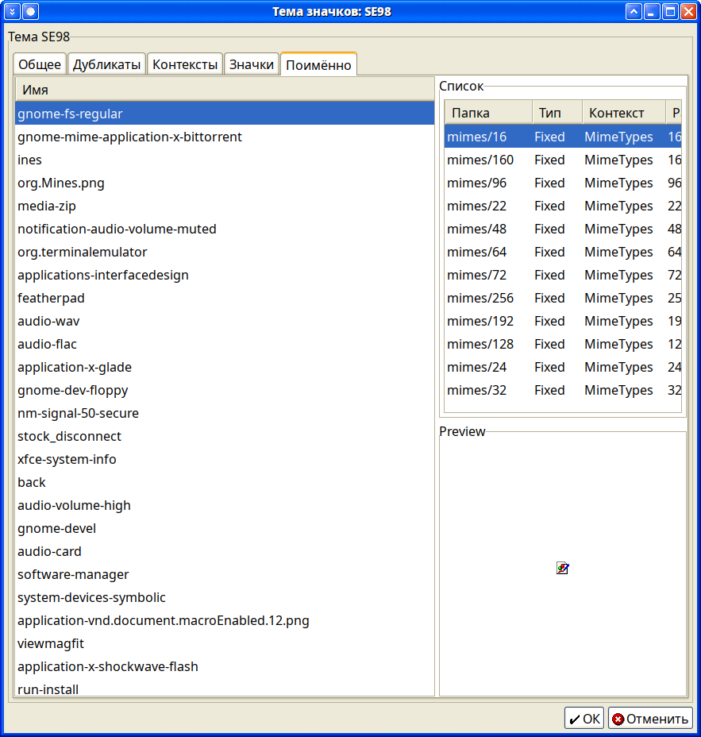

# Icon Theme Tool
Tool for viewing and editing icon themes

Uses [GAWK](https://www.gnu.org/software/gawk/) as back-end and [GTKDIALOG](code.google.com/p/gtkdialog) (the fresh forks are [here](https://github.com/bm16ton/gtkdialog) and [here](https://github.com/puppylinux-woof-CE/gtkdialog)) as a front-end.

Under development...

*Screenshoots:*

Main window: 

Found duplicates: 

Icons sorted by context: 

Icons with dimentions and preview: 

The sized folders, where icon of one name was found: 

In fact, I need the ability to create files with the .icon extension in this application, which will contain information about the name of the icon, its description, the points to which the emblems are attached, the coordinates of the preview frame.

I also need a tool for quickly creating symlinks. In the icon theme, to save space, identical icons with different names for different environments are made by symlinks. I need to be able to make them refer to one name and so that this tool can take the original icon and all its symlinks, and then I chose from them who will be the original so that all the others refer to it.